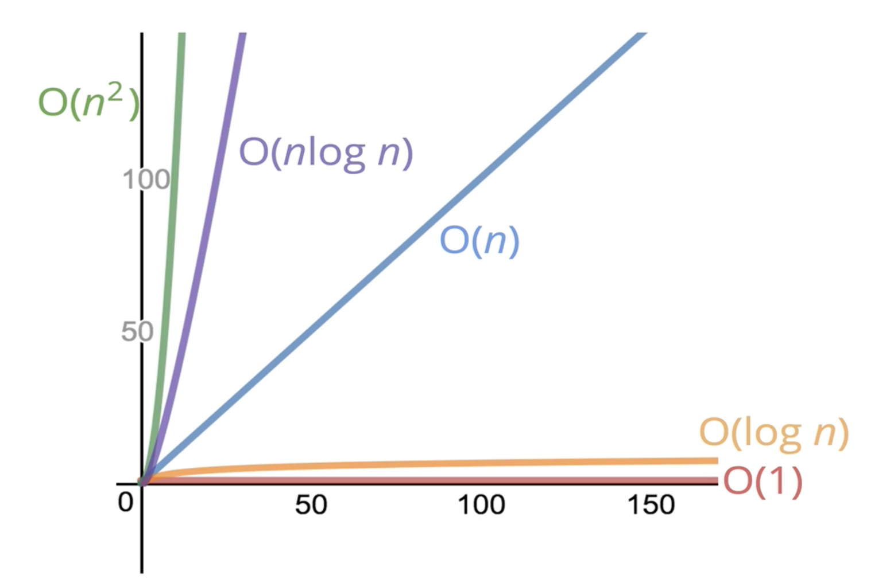

### **공간 복잡도** (Space Complexity)       

___

##### 첫번째 예제 코드
```javascript
function sum(arr) {
    let total = 0;  //변수 1 
    for (let i = 0; i < arr.length; i++) { //i라는 변수 1개
        total += arr[i];
    }
    return total;
}
```
총 2개의 변수가 존재, 공간 복잡도로 보았을때 arr의 값이 얼마나 들어오던 공간을 차지하고 있는 변수의 개수는 늘어나지 않는다.      

따라서, **공간 복잡도 : O(1)**

##### 두번째 예제 코드

```javascript
function double(arr) {
    let newArr = []; //빈 배열 생성
    for (let i = 0; i < arr.length; i++) {
        newArr.push(2 * arr[i]);
    }
    return newArr;
}
```
arr의 길이에 따라 newArr의 사이즈도 같은 크기로 커진다. (새로운 배열에 값을 담아서 리턴하므로)

따라서, **공간 복잡도 : O(n)**


