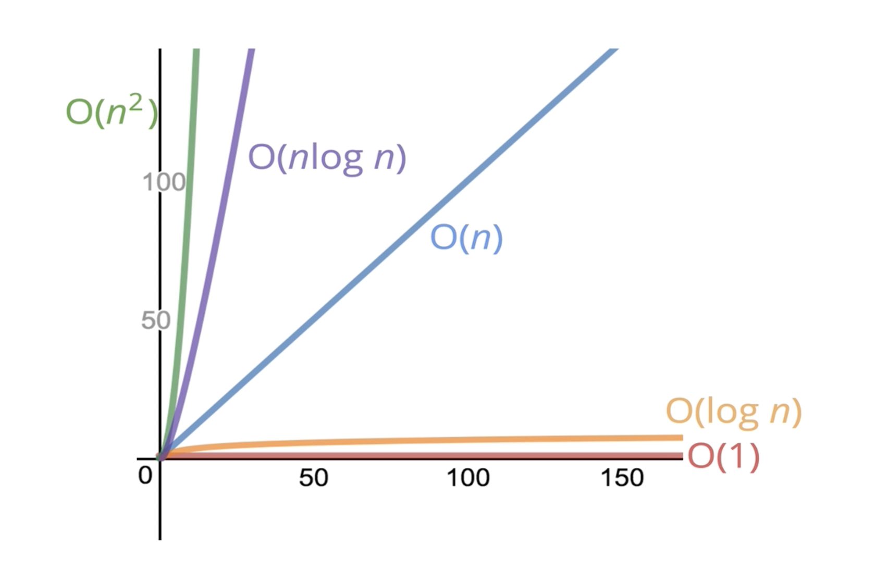

## Chapter 1. 빅오(Big O)

___

**Question**. 1에서부터 특정한 N값과 사이에 있는 모든 숫자들을 더하는 함수를 구현하시오. 

```javascript
function question1(N) {
    let result = 0;
    for (let i = 1; i <= N; i++) {
        result += i;
    }
    return result;
}
```
다른 해결 방법
```javascript
function sample1(N) {
    return N * (N + 1) / 2;
}
```

이 둘중에서 가장 나은 선택은?
1. 어떤 코드가 더 빠른것인가?
2. 메모리를 얼마나 사용하는가?
3. 코드를 쉽게 읽을 수 있는가?
       
먼저 **1번 기준(속도)** 으로 먼저 기준으로 잡을 것이다.

### 시간 복잡도(Time Complexity)
___
**알고리즘들이 얼마나 빠르게 실행되는지를 뚯한다.**

##### <u>1,000,000 이라는 숫자로 위의 코드를 실행했을 때</u>
- for문이 사용된 **첫번째 방법**은 **6.119ms**
- 계산식만 있는 **두번째 방법**은 **0.023ms**

시간을 측정하기 힘들 경우에는 연산 개수를 세면된다.       
        
다시 위의 코드로 돌아가 *두번째 코드* 를 보자.
```javascript
function sample1(N) {
    return N * (N + 1) / 2;
}
```
곱하기 : 1번, 더하기 : 1번, 나누기: 1번 -> **총 연산 3번**      
N이 어떤 값이 오던 이 함수는 **연산을 3번** 만 하게 되어있다.      
        
하지만 첫번째 코드를 보면
```javascript
function question1(N) {
    let result = 0;
    for (let i = 1; i <= N; i++) {
        result += i;
    }
    return result;
}
```
N의 값만큼 더하기 때문에 **연사자는 N 수만큼**이 되게 된다.       
큰 틀로 봐서 N만큼이지 저 함수 내에서는 사용된 연산자가 많다. ( 변수 선언의 = 조차도 연산자 )       
-> 연산자의 개수 : 5n + 2 

___
#### Big O 표현

1. f(n) = n   :  첫번째 함수의 경우, **O(n)**      
: n의 값이 커질 수록 실행시간이 1:1 비율로 증가하게 된다.
2. f(n) = n^2
3. f(n) = 1   :  두번째 함수의 경우, **O(1)**      
: n의 값이 커지더라도 연산은 한번만 함으로 속도의 영향을 주지 않는다.

<br/>

#### 다른 함수
___
```javascript
function anotherQuestion1(n) {
    for (let i = 0; i < n; i++) {
        console.log(i);
    } // 첫번째 for문 O(n)
    for (let j = n - 1; j >= 0; j--) {
        console.log(j);
    } // 두번째 for문 O(n)
}
```
O(n) 이 두번 사용됐기 때문에 O(2n)이라고 생각할 수 있지만,
하나의 함수로 봤을때는 **O(n)** 이 된다.     

```javascript
function antherQuestion2(n) {   // 중첩 루프 
    for (let i = 0; i < n; i++) {
        for (let j = 0; j < n; j++) {
            console.log(i, j);
        } // O(n)
    }// O(n)
}
```
위 함수에서 2개의 for문이 사용되었고 하나의 for문을 O(n) 이라고 표기했다.     
그렇다면 for문이 2개 연달아 사용됐을 경우에는 O(2n)이 되는걸까??       

그렇지 않다. 이중 루프로 되어있기 때문에 O(2n)이 아닌 **O(n^2)** 으로 표기한다.       
n이 10라고 가정할 경우 (10, 10) 까지 반복을 하기 때문에 2n이 아닌 **n^2**

<br/>

##### 또 다른 함수가 주어진다.
___
```javascript
function antherQuestion3(n) {
    for (let i = 1; i <= Math.max(5, n); i++) {
        console.log(i);
    }
}
```
이 함수의 빅오는 어떻게 될까?       
for 문을 보면 1에서 시작하지만 max 값에의해 5번 반복된다.       
**n이 5보다 크다면? n의 수만큼 반복을 돌게 된다.**       
        
따라서 **빅오 : O(n)** 로 표현이 된다.

<br/>

```javascript
function antherQuestion3(n) {
    for (let i = 1; i <= Math.min(5, n); i++) {
        console.log(i);
    }
}
```
위 함수와 다른 반대의 함수     
n이 5보다 클 경우 **어떤 숫자가 와도 최소인 5번만** 반복 돌게 된다.

따라서 **빅오 : O(1)** 로 표현이 된다.

비슷한 반복문이라도 늘어나는 수에 따라서 빅오 표현이 달라지게 된다.

##### 아래 그래프에서 O(n) 과 O(1)을 확인 해보면



___
위에서 1번 (속도)에 관하여 확인해보았다면

이번에는 **공간, 사용되는 메모리** 를 확인해 볼 것이다. (Space Complexity)


